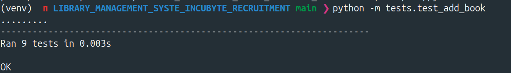
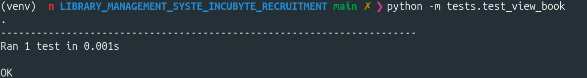
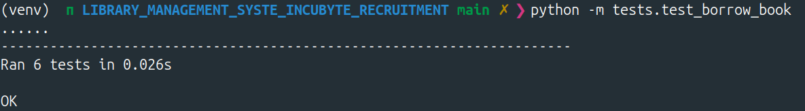
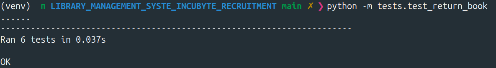
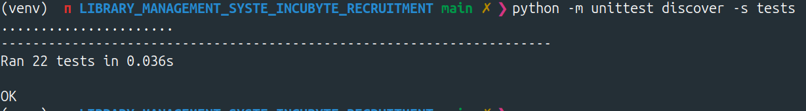
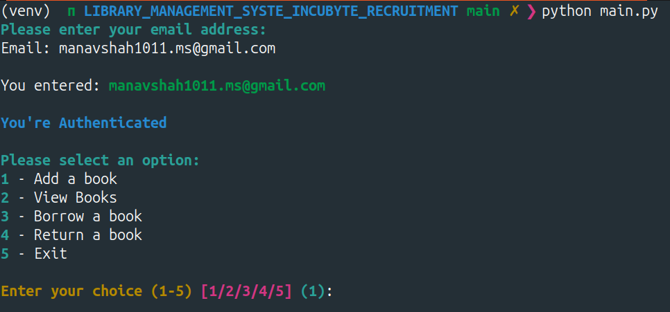
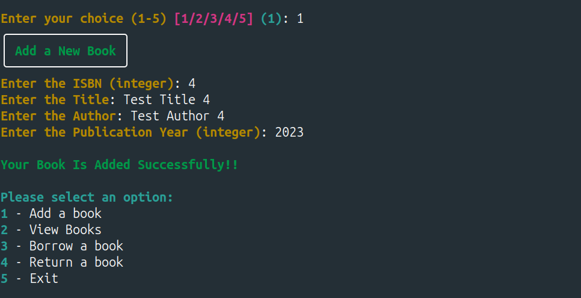
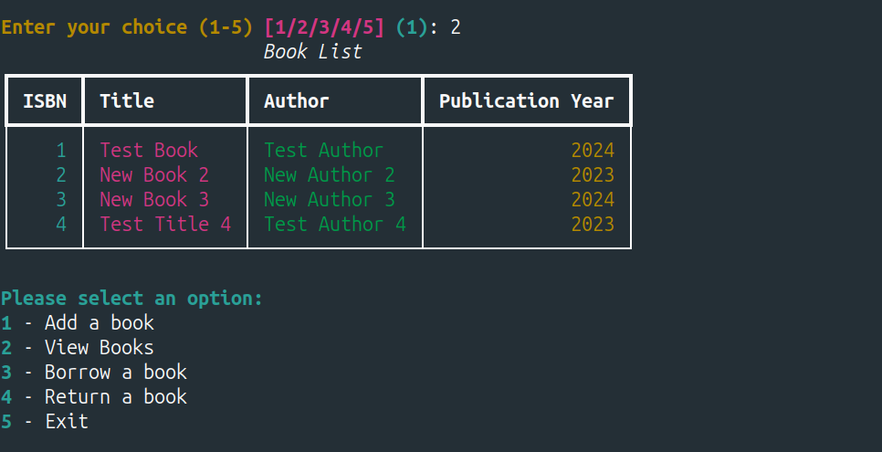
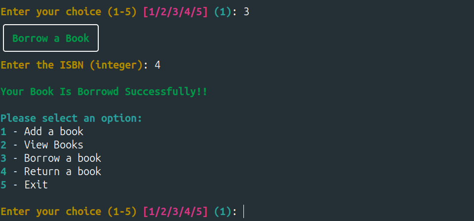
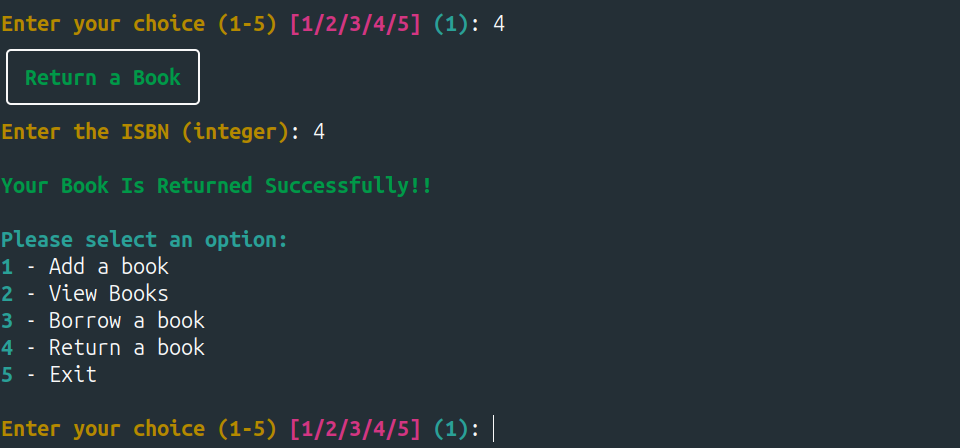

# Library Management System

**This project is a Library Management System developed as part of the Incubyte Recruitment Process. The system was implemented in Python, adhering to the guidelines provided in the recruitment process document. The project emphasizes Test-Driven Development (TDD), clean coding practices, and proper use of Python-specific features.**

**I followed a structured Git workflow, making clear and descriptive commits to specify the changes and updates at each step. Additionally, I logged the output of the tests in dedicated log files, which are updated with each new commit. This demonstrates the iterative process of Test-Driven Development (TDD) and provides a detailed history of the project's evolution.**

**For simplicity, I used SQLite3 as a file-based database.**

> ###### ***The log files are : /tests/add_book_ouptut.log  | tests/test_borrow_book.py | tests/borrow_book_output.log | tests/return_book_output.log***

## Key Features

- **Add Book:** Allows the user to add a book to the library with an ISBN, title, author, and publication year.
- **View Books:** Displays all the books available in the library.
- **Borrow Book:** Enables a user to borrow a book by entering the ISBN and user ID.
- **Return Book:** Allows a user to return a borrowed book.

## Assessment Focus

The following aspects were emphasized during the development:

- **Adherence to TDD Principles:** The project follows TDD principles, ensuring robust and reliable code.
- **Frequency and Quality of Git Commits:** Regular and meaningful commits were made throughout the development process.
- **Clean Coding Practices:** The codebase is structured, readable, and maintains best practices.
- **Proper Use of Python-Specific Features and Idioms:** The project leverages Python's features, such as type annotations and exceptions, effectively.

## Installation

## 1. Normal Installationgit clone 

```bash
git clone https://github.com/Manav1011/LIBRARY_MANAGEMENT_SYSTEM_INCUBYTE_RECRUITMENT.git
cd LIBRARY_MANAGEMENT_SYSTEM_INCUBYTE_RECRUITMENT

pip install -r requirements.txt

# Initialize the sqlite database
python db_initializer.py

# to run the tests individually
python -m tests.test_add_book
python -m tests.test_view_book.py
python -m tests.test_borrow_book.py
python -m tests.test_return_book.py

#To run all the tests at once
python -m unittest discover -s tests

# TO run the user interface
python main.py
```

## 2. Using Docker

```bash
git clone https://github.com/Manav1011/LIBRARY_MANAGEMENT_SYSTEM_INCUBYTE_RECRUITMENT.git
cd LIBRARY_MANAGEMENT_SYSTEM_INCUBYTE_RECRUITMENT

sudo docker build -t lms .

docker run -it lms /bin/bash  

# Initialize the sqlite database
python db_initializer.py

# to run the tests individually

python -m tests.test_add_book
python -m tests.test_view_book.py
python -m tests.test_borrow_book.py
python -m tests.test_return_book.py

#To run all the tests at once
python -m unittest discover -s tests

# TO run the user interface
python main.py 
```

## Here are the screenshots of the running the test cases locally

#### Performing tests one by one

1. **test_add_book**

   
2. test_view_book
3. test_borrow_book
4. . test_return_book

#### Performing tests one by All AT ONCE



## Here are the screenshots of the user interface locally











## Tech Stack

* Programming Language - Python
* Testing Module - unittest - (https://pypi.org/project/unitest)
* UI library - rich - (https://pypi.org/project/rich/)
